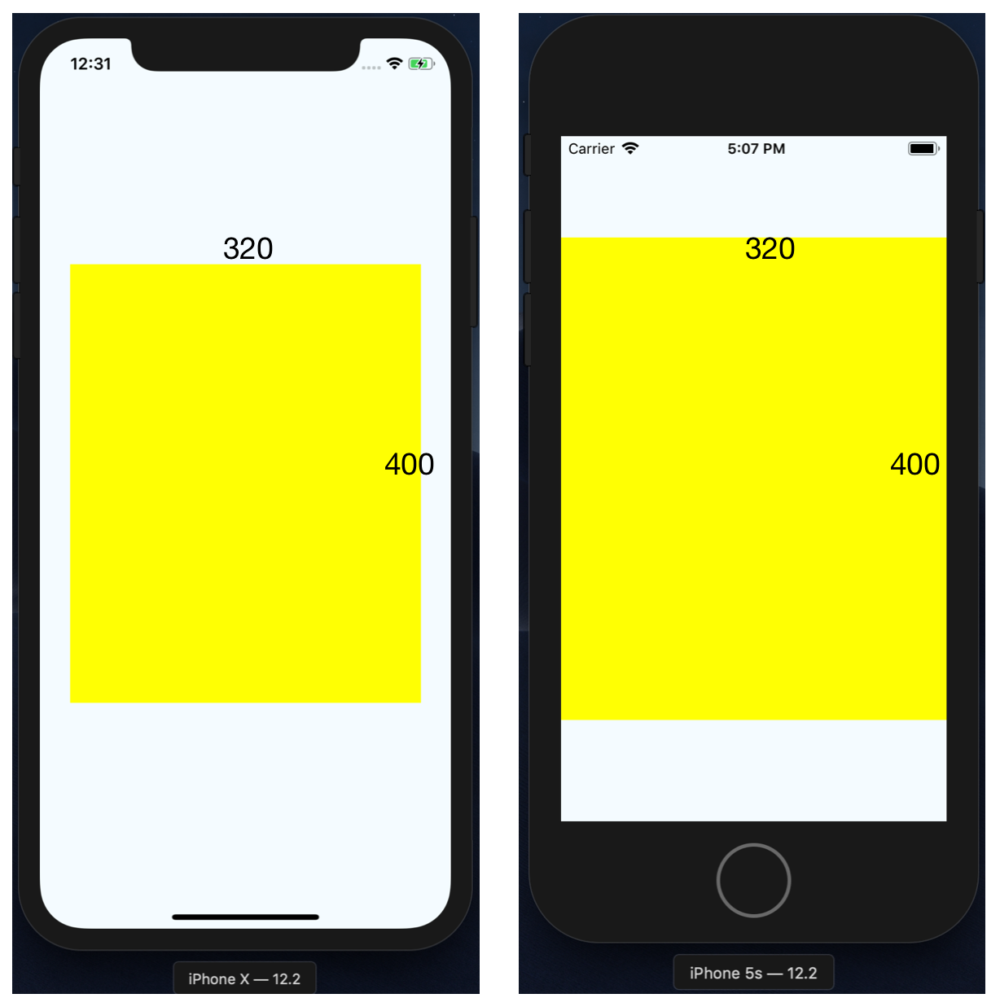
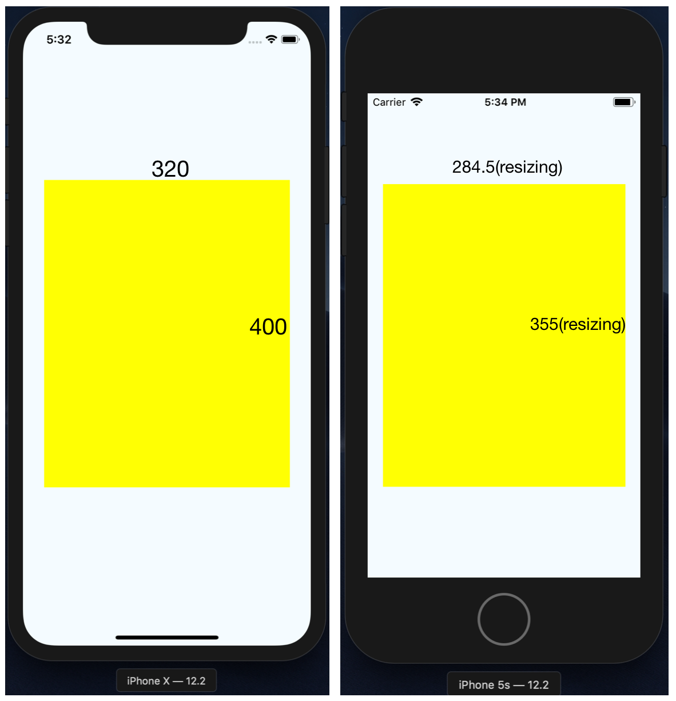

# react-native-lightweight-responsive

`react-native-lightweight-responsive` can change the size of your component into optimized size, based on the default UI size of design prototype.

If you have UI prototype design and the default size of prototype is 375 X 812, some devices is OK, but others have problems like below.



*What is right is not what you want.*


## Simple Usage

**install**

```
npm install --save react-native-lightweight-responsize
```

**usage**

```
import Responsive from 'react-native-lightweight-responsive';

<View style={{
  width: Responsive.width(320),
  height: Responsive.height(400),
}}/>
```

**and then?**




## API

| Name          | Type           | Param  | Description |
| ------------- |:-------------:| -----:| -----:  |
| setOptions    | func | `{width: 360, height: 640, enableOnlySmallSize: false}` | `width`, `height` sets the default size. `enableOnlySmallSize` will apply `Responsive`'s features to smaller than default size if `true`.  |
| width         | func      | `width`  | The size (`width`) that will be changed, based on the default size (`width`) that you set using `setOptions`.  |
| height        | func | `height` | The size (`height`) that will be changed, based on the default size (`height`) that you set using `setOptions`. |

## Example
